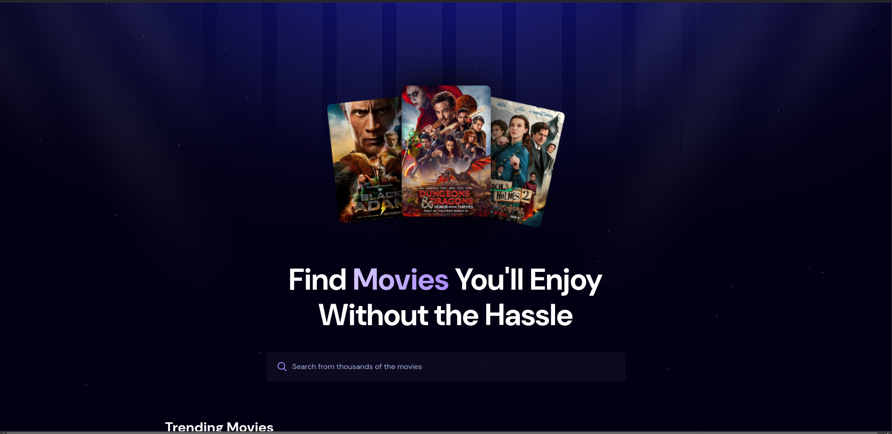
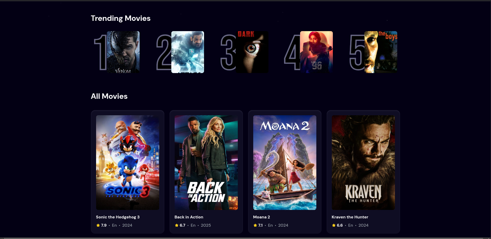

# MooviFlix

This is a simple React Application which is built using the TMDB (The Movie Database) API. It consists of the all movies and TV series and users can search through the app to get the details of the and ratings of the movie.

The trending movie section of the movie is based on the most search titles by the users. The search count is stored the the database using AppWrite.

### Tech Stacks:

ReactJS
TailwindCSS (https://tailwindcss.com/)
Vite (https://vite.dev/)
Appwrite (https://appwrite.io/)
react-use (https://www.npmjs.com/package/react-use)

### Preview:

